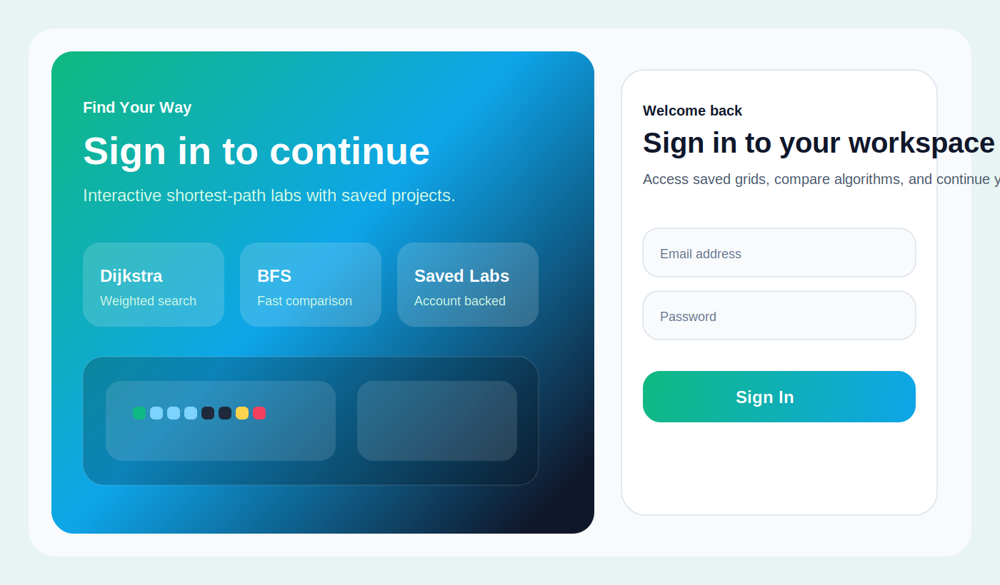
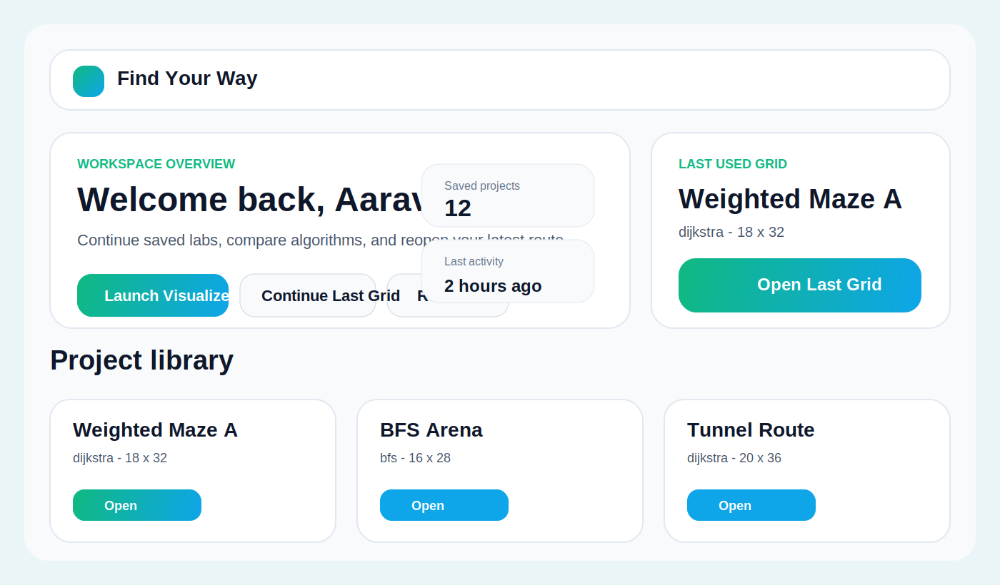
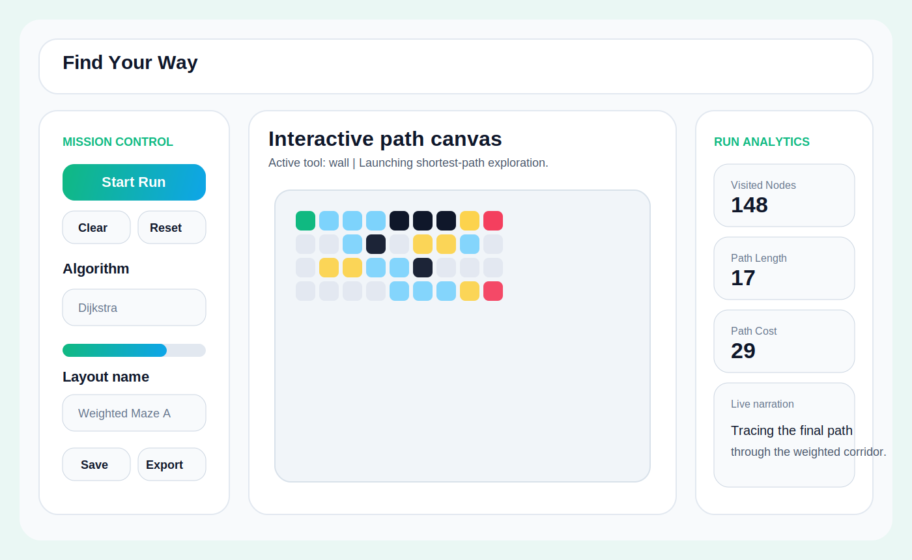

# Find Your Way

Find Your Way is a production-ready full-stack pathfinding visualizer built with React, Vite, Tailwind CSS, Framer Motion, Node.js, Express, JWT auth, bcrypt, and MongoDB. It ships with a polished authentication flow, an interactive shortest-path grid, saved user projects, and deployment-ready configuration for Vercel and Render.

## UI previews

### Login / signup experience


### Dashboard with saved grids


### Visualizer workspace


## Features

- Interactive grid editor with start node, end node, walls, and weighted nodes
- Dijkstra's Algorithm with a priority queue
- BFS comparison mode for unweighted shortest-path exploration
- Animated visited nodes, active frontier node, and final shortest path
- Auto mode and step-by-step execution mode
- Real-time animation speed control
- Protected dashboard with JWT authentication
- Password hashing with bcrypt
- Save, load, update, and export grid layouts
- Last-used grid recovery per user
- Dark mode toggle
- Vercel-ready frontend and Render-ready backend

## Tech stack

### Frontend

- React with Vite
- Tailwind CSS
- Framer Motion
- React Router

### Backend

- Node.js
- Express
- MongoDB with Mongoose
- JWT authentication
- bcrypt password hashing

## Project structure

```text
find-your-way/
  client/
    public/
    src/
      components/
      context/
      hooks/
      pages/
      services/
      utils/
  server/
    src/
      config/
      controllers/
      middleware/
      models/
      routes/
      utils/
  docs/
  render.yaml
  vercel.json
```

## Local setup

### 1. Install dependencies

```bash
npm install
```

### 2. Configure environment variables

Copy the example files:

```bash
cp .env.example .env
cp client/.env.example client/.env
cp server/.env.example server/.env
```

If you are on Windows PowerShell, use:

```powershell
Copy-Item .env.example .env
Copy-Item client\.env.example client\.env
Copy-Item server\.env.example server\.env
```

### 3. Required environment variables

#### Frontend

```env
VITE_API_BASE_URL=http://localhost:5000/api
```

#### Backend

```env
PORT=5000
NODE_ENV=development
MONGODB_URI=mongodb://127.0.0.1:27017/find-your-way
JWT_SECRET=replace-with-a-long-random-secret
JWT_EXPIRES_IN=7d
CLIENT_ORIGIN=http://localhost:5173
```

### 4. Start the app

```bash
npm run dev
```

This starts:

- frontend on `http://localhost:5173`
- backend on `http://localhost:5000`

## Scripts

### Root

- `npm run dev` runs client and server together
- `npm run build` builds the frontend for production

### Client

- `npm run dev --workspace client`
- `npm run build --workspace client`
- `npm run preview --workspace client`

### Server

- `npm run dev --workspace server`
- `npm start --workspace server`

## Backend API overview

- `POST /api/auth/signup`
- `POST /api/auth/login`
- `GET /api/auth/me`
- `GET /api/grids`
- `GET /api/grids/last`
- `GET /api/grids/:id`
- `POST /api/grids`
- `PUT /api/grids/:id`
- `POST /api/grids/:id/activate`
- `DELETE /api/grids/:id`

## Deployment

### Deploy frontend to Vercel

This repo already includes a root [vercel.json](./vercel.json).

1. Push the repository to GitHub.
2. Import the repository into Vercel.
3. Keep the project root at the repository root.
4. Add the frontend environment variable:

```env
VITE_API_BASE_URL=https://your-render-api.onrender.com/api
```

5. Deploy.

Vercel will use:

- `npm install`
- `npm run build`
- output directory `client/dist`

### Deploy backend to Render

This repo includes [render.yaml](./render.yaml) for quick setup.

1. Create a MongoDB database, preferably MongoDB Atlas.
2. Push the repository to GitHub.
3. Create a new Render Web Service from the repo, or use the included `render.yaml`.
4. Set the backend environment variables:

```env
PORT=5000
NODE_ENV=production
MONGODB_URI=your-mongodb-connection-string
JWT_SECRET=your-long-random-secret
JWT_EXPIRES_IN=7d
CLIENT_ORIGIN=https://your-vercel-domain.vercel.app
```

5. Render will use:

- root directory: `server`
- build command: `npm install`
- start command: `npm start`

### Deployment order

1. Deploy the backend to Render and copy the public API URL.
2. Add that URL as `VITE_API_BASE_URL` in Vercel.
3. Deploy the frontend to Vercel.
4. Update `CLIENT_ORIGIN` on Render to match the Vercel domain if it changes.

## Implementation notes

- Dijkstra uses a custom min-priority queue for efficient weighted routing.
- BFS is included as a secondary comparison algorithm.
- Grid layouts are persisted per user in MongoDB.
- Authenticated routes are protected in the client and validated again on the server.
- The UI is responsive and optimized for desktop and tablet use.

## Next ideas

- Add sound effects for node visits
- Add collaborative sharing links
- Add more algorithms such as A* and DFS
